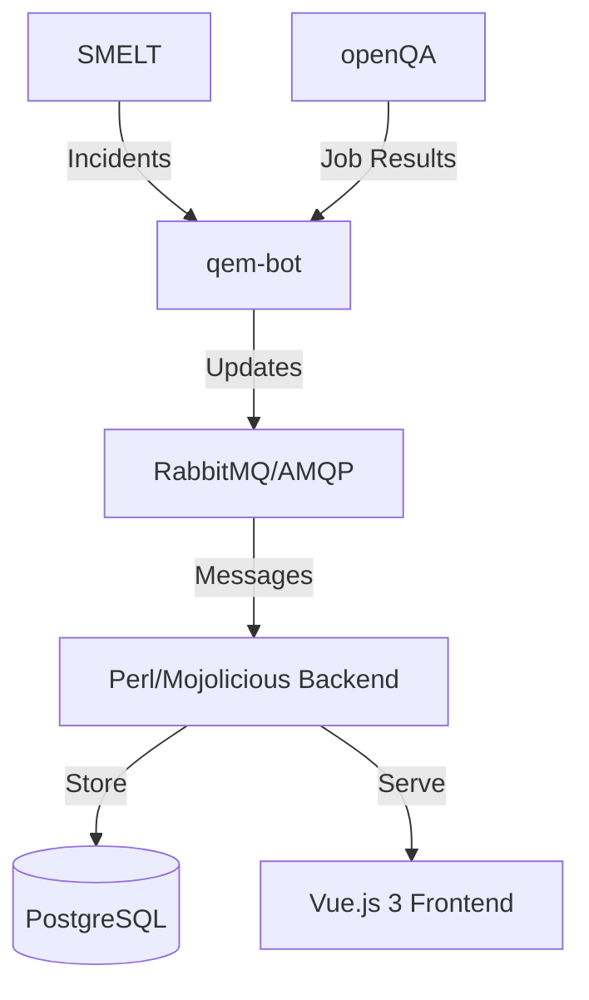

# Architecture & Data Flow

This document describes the high-level architecture of the QEM Dashboard and how data flows through the system.

## System Overview



## Data Lifecycle

1.  **External Sources**: SMELT provides information about maintenance incidents. openQA provides test results for those incidents.
2.  **Bot Interaction**: `qem-bot` monitors these sources and publishes updates to a RabbitMQ exchange.
3.  **Real-time Updates**: The `amqp_watcher` (a Mojolicious command) listens for messages on the message bus.
4.  **Backend Processing**: When a message is received, the backend updates the PostgreSQL database.
5.  **Frontend Display**: The Vue.js frontend polls the backend API at regular intervals to fetch the latest state and display it to the user.

## Component Responsibilities

- **Backend (Perl/Mojolicious)**:
  - Provides a REST API for the frontend.
  - Handles database migrations.
  - Consumes AMQP messages.
- **Frontend (Vue.js 3)**:
  - Provides a responsive user interface.
  - Manages application state with Pinia.
  - Handles routing with Vue Router.
- **Database (PostgreSQL)**:
  - Persistent storage for incidents, settings, and job results.

```

```
